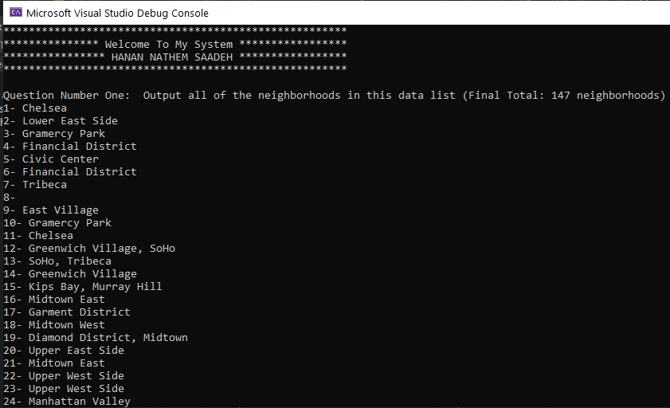
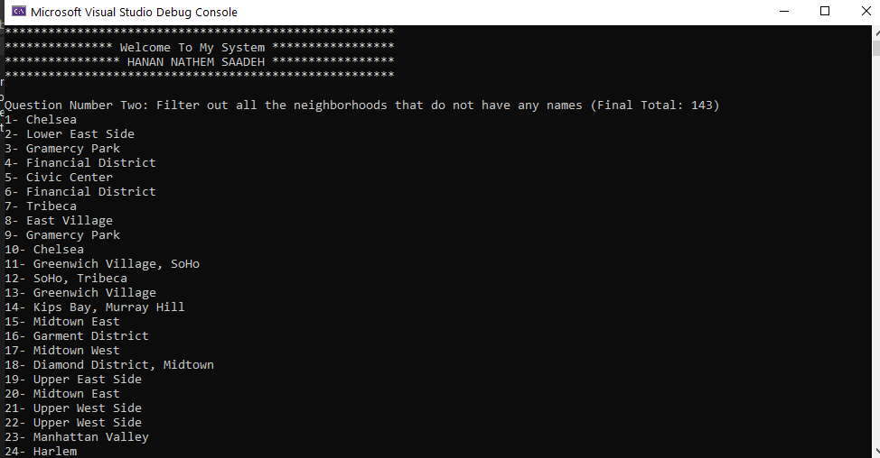
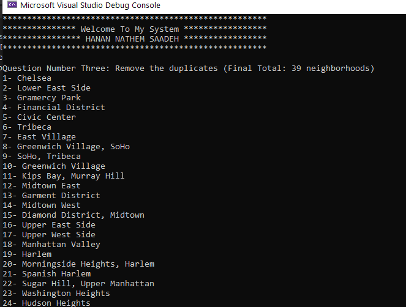
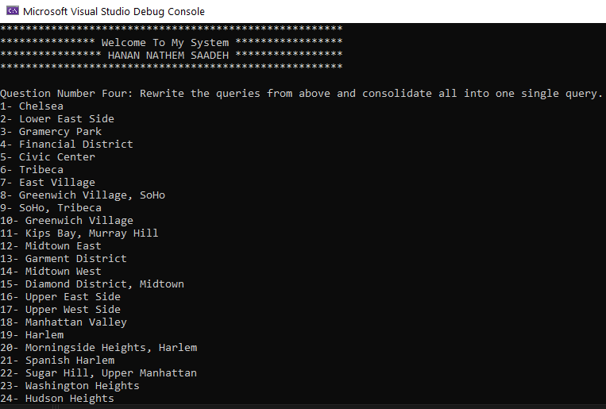
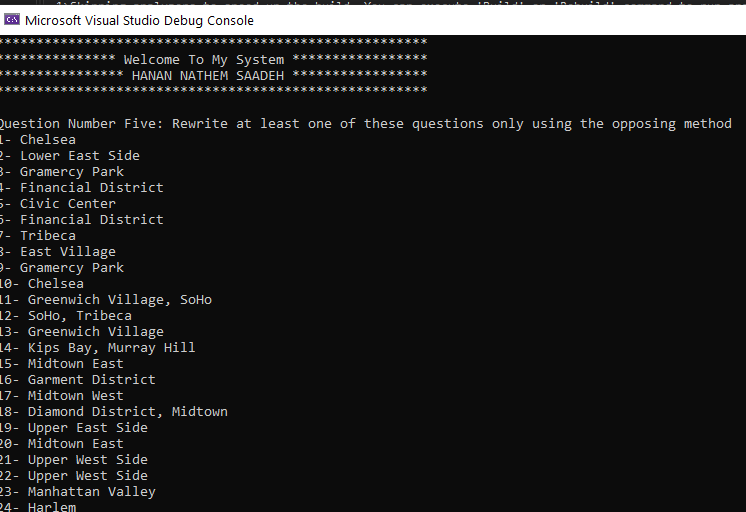

# Lab9-LINQInManhattan

## The Problem Domain
Create a program that brings in data from an external file, reads the data, and can filter the data based on specified values.

## Visual
First Question :

Second Question :

Third Question :

Fourth Question :

Fifth Question :

## How do you run the program?
- Clone repo to your device.
- Open the solution file LINQ-In-Manhattan.sln in Visual Studio.
- To run the app, go to Debug > Start Without Debugging (or press ctrl+F5).
